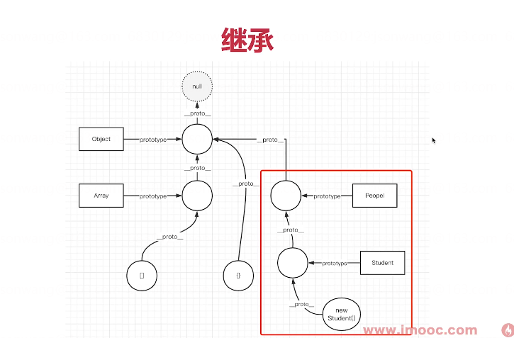

# TS 简介

TS 是 JS 的超级 Super-Set ，即包含 JS 所有能力，然后再有自己自己的能力 —— 静态类型。

PS：大型系统的量大研发保障：1. 静态类型； 2. 自动化测试；

注意，TS 类型的知识点非常多，先介绍常用的，其他的遇到再说。

## TS 最终编译为 JS

TS 只是开发环境的工具，构建之后产出 JS 在浏览器运行。

https://www.tslang.cn/play/index.html

## 基础类型

值类型

- `boolean`
- `number`
- `string`
- `symbol`
- `any` —— 重要

数组：`number[]` 或 `Array<number>`

元组 `Array<number | string>`

对象 `object` —— 不常用，一般会用 interface 或 class 代替

函数 `Function` —— 不常用，一般用自定义 type 代替

类型断言：让 TS 计算你需要的类型，而不用自己定义

## 函数

- 参数类型
- 返回值类型，有 `void`

## 自定义 type

基础类型不能满足，就自定义

```ts
type infoType = string | number
type fnType = (a: number, b: string) => void

const a: infoType = 10
const fn: fnType = (a: number, b: string) {}
```

## 接口 interface

一些类型的集合，也可以用自定义 type 和其他 interface

```ts
// 注意，interface 的写法
interface IPerson {
  name: string;
  age: number;
  sayHi: (otherName: string) => void;
}

const zhangsan: IPerson = {
  name: "张三",
  age: 20,
  sayHi(otherName: string) {
    alert(`你好 ${otherName}`);
  },
};
```

```javascript

// 值类型
let b: boolean = true
let n: number = 100
let str: string = 'hello'
let s: symbol = Symbol()

// 类型断言
let n1 = 200 // number

// 或
let x: number | string | boolean = false

// any 一定要慎用 （不要 AnyScript）
let y: any = []

// 数组
let arr: string[] = ['a', 'b', 'c']
let numArr: Array<number> = [10, 20, 30]

// 元组
let arr1: Array<string | number | boolean> = [10, 'hello', true]

// // 对象类型 - object 不常用，不专业
// let obj: object = { x: 10, y: 20 }
// // 函数类型 - Function 不常用，不专业
// let fn: Function = (x: number, y: string) => {}

// 函数：参数，返回值
function fn(n1: number, n2: number): void {
    // return n1 + n2
}

// 自定义类型
type infoType = string | number
let info1: infoType = 100
type fnType = (a: number, b: number) => void // 函数，细节
const fn1: fnType = (a: number, b: number): void => {
    // ...
}

// interface
interface IPerson {
    name: string
    age: number
    fn1: fnType
}

// interface 用于 object
const zhangsan: IPerson = {
    name: '张三',
    age: 20,
    fn1(a: number, b: number) {}
}

// interface 用于 class
class Person implements IPerson {
    name: string
    age: number

    constructor(name: string, age: number) {
        this.name = name
        this.age = age
    }

    fn1(a: number, b: number): void {

    }
}

```

## 类 class

在 ES6 class 基础上增加了类型，class 可实现 interface

```ts
class Person implements IPerson {
  name: string;
  age: number;

  constructor(name: string, age: number) {
    this.name = name;
    this.age = age;
  }

  sayHi(otherName: string) {
    alert(`你好 ${otherName}`);
  }
}
```

class 还有一些特性，在下一节面向对象介绍

## 小结

- 基础类型
- 函数
- 自定义 type
- interface
- class

# 什么是面向对象

面向对象编程，Object-Oriented-Program（简称 OOP）是一种目前主流的编程思想。<br>
已有几十年的历史，1990 年代开始，和 Java 一起开始发展壮大。

编程本来是抽象的，像做数学题一样。
一开始的汇编语言，直接操作寄存器、内存，写底层计算。后来的 C 语言，各种函数和指针。

而 OOP 引入了“对象”概念，对象即对应生活中的实物，这样就把编程具象化了。
具象化之后学习成本就低了，也就随着计算机革命普及开来。

设计模式就是基于 OOP 编程思想的，不适用于其他编程思想（如函数式编程）

## 类和对象

类，即模板

```ts
class People {
  name: string;
  age: number;

  constructor(name: string, age: number) {
    this.name = name;
    this.age = age;
  }

  // 如果函数不写返回值类型，则默认为 void
  eat() {
    alert(`${this.name} eat something`);
  }

  speak() {
    alert(`My name is ${this.name}, age ${this.age}`);
  }
}
```

对象，即实例。一个类可以 `new` 出很多个对象。

```ts
// 创建实例
let zhang = new People("zhang", 20);
zhang.eat();
zhang.speak();

// 创建实例
let wang = new People("wang", 21);
wang.eat();
wang.speak();
```

## 三要素

- 继承
- 封装
- 多态

### 继承

继承：抽离公共代码，实现代码复用

```ts
class Student extends People {
  school: string;

  constructor(name: string, age: number, school: string) {
    super(name, age);
    this.school = school;
  }
  study() {
    alert(`${this.name} study`);
  }
}
// 可继续派生其他子类

let xiaoming = new Student("xiaoming", 10, "A小学");
xiaoming.study();
console.log(xiaoming.school);
let xiaohong = new Student("xiaohong", 11, "B小学");
xiaohong.study();
```

### 封装

封装：高内聚，低耦合

可见性修饰符

- `public` 外部可访问，默认
- `protected` 内部或子类可访问
- `private` 只有内部可访问

```ts
// People 中增加 protected weight: number
// Student 中增加 private girlfriend: string
```

### 多态

多态：保证扩展性

- 重写 - 覆盖父组件的方法
- 重载 - 支持多种参数形式

```ts
interface IStyleInfo {
  [key: string]: string;
}

class JQuery {
  // 函数重载
  css(key: string, value: string);
  css(styleInfo: IStyleInfo);
  css(keyOrStyleInfo: string | IStyleInfo, value?: string) {
    if (typeof keyOrStyleInfo === "string") {
      // key-value 形式
      const key = keyOrStyleInfo;
      console.log("Set CSS", key, value);
    } else {
      // object 形式
      const styleInfo = keyOrStyleInfo;
      for (const key in styleInfo) {
        const value = styleInfo[key];
        console.log("Set CSS", key, value);
      }
    }
  }
}

const jquery = new JQuery();
jquery.css("color", "red");
jquery.css({ color: "red", "font-size": "14px" });
```

## Vue React 组件也是对象

组件定义就相当于 class ，组件使用就相当于 new class

```html
<!-- 定义一个 SomeComponent.vue 组件 -->

<!-- page1 -->
<template>
  <some-component :name="a"></some-component>
</template>

<!-- page2 -->
<template>
  <some-component :name="b"></some-component>
</template>
```

## 总结

- 类和对象
- 三个特点（重要）
- Vue React 组件也是对象

```javascript
class People {
    name: string
    age: number
    // protected weight: number = 100
    // private girlfriend: string = 'xxx'
    constructor(name: string, age: number) {
        this.name = name
        this.age = age
    }
    eat() {
        alert(`${this.name} eat something`)
    }
    speak() {
        alert(`My name is ${this.name}, age ${this.age}`)
    }
}

class Student extends People {
    school: string
    constructor(name: string, age: number, school: string) {
        super(name, age)
        this.school = school
    }
    study() {
        alert(`${this.name} study`)
    }
    eat() {
        alert(`${this.name} eat apple`)
    }
}

class Teacher extends People {
    major: string
    constructor(name: string, age: number, major: string) {
        super(name, age)
        this.major = major
    }
    teach() {
        alert(`${this.name} teach ${this.major}`)
    }
}

const xiaoming = new Student('小明', 10, 'A小学')
xiaoming.study()
xiaoming.eat()
xiaoming.speak()

const shuangyue = new Teacher('双越', 25, '语文')
shuangyue.teach()
shuangyue.eat()
shuangyue.speak()
shuangyue.age

// const zhangsan = new People('张三', 20)
// zhangsan.eat()
// zhangsan.speak()
// zhangsan.age

// const lisi = new People('李四', 21)
// lisi.eat()
// lisi.speak()
// lisi.age

// 封装：可见性修饰符：
// - public - 所有都可以访问
// - protected - 当前类，或者子类可访问，外部不可访问
// - private - 只能在当前类内部访问，其他都不行

// 多态：
// - 重写
// - 重载

interface IStyleInfo {
    [key: string]: string
}

class JQuery {
    css(key: string, value: string): void
    css(styleInfo: IStyleInfo): void
    css(keyOrInfo: string | IStyleInfo, value?: string): void {
        if (typeof keyOrInfo === 'string') {
            // key value
        } else {
            // object
        }
    }
}

const j = new JQuery()
j.css({ 'font-size': '15px', 'color': 'red' })
j.css('color', 'red')

```

# 设计原则

设计原则和设计模式都不难理解，它们是“讲道理”的。
因为：计算机越偏向底层就越简单、执拗、越傻（如必须使用二进制，不使用十进制），因为其本质是电子 + 数学。
而越偏向于高层或者表层就要越聪明，越任性（如 java 语言，设计原则），因为其本质是应对变化和需求。

但这个道理一定是**理性**的：
感性和理性永远是一对矛盾。感性喜欢宣传“多快好省”，但理性就需要思考如何具体实现，以及低成本的运作和维护（全流程）。
俗话说“书生误国”，文科生喜欢夸夸其谈，说理想，说结果，但从不考虑如何实现，以及如何监控、运维。
设计原则，设计模式，乃至整个软件工程，都是基于纯理性的思考。

## 五大设计原则

S O L I D 五大设计原则

- S 单一职责原则
- O 开放封闭原则
- L 李氏置换原则
- I 接口独立原则
- D 依赖导致原则

### 单一职责原则

一个程序只做好一件事，如果功能过于复杂就拆分开，每个部分保持独立。

### 开放封闭原则 —— 最重要

对修改封闭，对扩展开放，**这是软件设计的终极目标**。即要设计一种机制，当需求发生变化时，根据这种机制扩展代码，而不是修改原有的代码。

### 李氏置换原则

子类能覆盖父类，父类能出现的地方子类就能出现 —— 前端应用较少。

### 接口隔离原则

保持接口的单一独立，避免出现“胖接口”。类似于单一职责原则，只不过前者说的比较统一，后者是单独对接口的规定。JS 中没有接口，因此体现较少。

### 依赖倒置原则

面向接口编程，依赖于抽象而不依赖于具体。写代码时用到具体类时，不与具体类交互，而与具体类的上层接口交互。

```ts
function fn(p: Student) {} // 依赖具体的类
function fn(p: IPerson) {} // 依赖接口
```

## 举例说明

以常见的 Promise 来解释一下前两个原则。

```ts
// 加载图片
function loadImg(src: string) {
  const promise = new Promise((resolve, reject) => {
    const img = document.createElement("img");
    img.onload = () => {
      resolve(img);
    };
    img.onerror = () => {
      reject("图片加载失败");
    };
    img.src = src;
  });
  return promise;
}

const src = "https://www.imooc.com/static/img/index/logo_new.png";

const result = loadImg(src);
result
  .then((img: HTMLImageElement) => {
    console.log("img.width", img.width);
    return img;
  })
  .then((img: HTMLImageElement) => {
    console.log("img.height", img.height);
  })
  .catch((err) => {
    console.log(err);
  });
```

- 单一职责原则：每个`then`中的逻辑只做好一件事，如果要做多个就用多个`then`
- 开放封闭原则：如果这个需求要修改，那去扩展`then`即可，现有的逻辑不用修改，即对扩展开放、对修改封闭

这里引申两点：

- 其实 S 和 O 是相符现成的，相互依赖
- 开放封闭原则的好处不止于此，从整个软件开发流程看，减少现有逻辑的更改，也会减少测试的成本

## 总结

- SOLID 五大设计原则
- 重点理解前两个 S 和 O

# UNIX Linux 设计哲学

大型复杂的系统，才能体现出设计的价值。操作系统是这个世界上最复杂的系统之一，他的设计思路值得我们学习。

按我的理解，通俗来说，设计（仅指编程设计）就是按照哪一种思路或者标准来实现功能。同样的功能，不同的设计思想都能用不同的方式来实现，前期效果可能一样，但是随着产品功能的增加和扩展，设计的作用才会慢慢的显示出来。

## 目录

结合《UNIX/Linux 设计哲学》中提到的系统设计原则 https://github.com/wangfupeng1988/read-notes/blob/master/book/Linux-Unix%E8%AE%BE%E8%AE%A1%E6%80%9D%E6%83%B3.md 。可能有一些会跟传统思想有区别，但是请你重视它们。

- 准则 1：小即是美
- 准则 2：让每个程序只做好一件事
- 准则 3：快速建立原型
- 准则 4：舍弃高效率而取可移植性
- 准则 5：采用纯文本来存储数据
- 准则 6：充分利用软件的杠杆效应（软件复用）
- 准则 7：使用 shell 脚本来提高杠杆效应和可移植性
- 准则 8：避免强制性的用户界面
- 准则 9：让每个程序都称为过滤器
- 十条小准则
  - 允许用户定制环境
  - 尽量使操作系统内核小而轻量化
  - 使用小写字母并尽量简短
  - 保护树木
  - 沉默是金
  - 并行思考
  - 各部分之和大于整体
  - 寻求 90% 的解决方案
  - 更坏就是更好
  - 层次化思考

无论你现在能否理解以上这些准则，我都希望你每隔一段时间（如半年）都重新自省一下，看自己结合自己的工作经历，是否又加深了这些准则的理解。

# 23 种设计模式

## 从设计到模式

“设计”和“模式”两个词应该分开读，先有设计，后有模式。

- 设计：设计原则，设计思想
- 模式：前辈总结出来的固定的套路

为何需要设计？—— 因为软件规模变大，甚至是一个系统集群，需要先设计，后开发，否则就乱掉

为何需要模式？—— 可套用前人经验，降低设计和沟通的成本

## 23 种设计模式

1995 年，四位前辈出版了一本书《设计模式：可复用面向对象软件的基础》，里面总结了常用的 23 种设计模式，被后人一直沿用至今。

- 创建型模式
  - **工厂模式**（包括：工厂方法模式，抽象工厂模式，建造者模式）
  - **单例模式**
  - **原型模式**
- 结构型模式
  - 适配器模式
  - **装饰器模式**
  - **代理模式**
  - 外观模式
  - 桥接模式
  - 组合模式
  - 享元模式
- 行为型模式
  - 策略模式
  - 模板方法模式
  - **观察者模式**
  - **迭代器模式**
  - 职责连模式
  - 命令模式
  - 备忘录模式
  - 状态模式
  - 访问者模式
  - 中介者模式
  - 解释器模式


## 前端常用的设计模式

> 这就是课程的价值，帮你节省时间，直击重点，不盲目

1995 年还没有前端，所有当时的一些设计模式，并不完全适用于现在。而且，前后端也有区别。

所以，前端最常用的设计模式，就以下几个：

- 工厂模式
- 单例模式
- 原型模式
- 装饰器模式
- 代理模式
- 观察者模式
- 迭代器模式

要结合实际应用，把它们学精、学透彻，要明白 JS 是如何体现这些设计模式的。
让你学完了就忘不了（不常用的，学完就忘）

## 总结

- 从设计到模式
- 23 种设计模式
- 前端常用设计模式

# 工厂模式

- 遇到 new class 的地方,就可以考虑工厂模式

```javascript
class Product {
    name: string
    constructor(name: string) {
        this.name = name
    }
    fn1() {
        alert('product fn1')
    }
    fn2() {
        alert('product fn2')
    }
}

// 工厂
class Creator {
    create(name: string): Product {
        return new Product(name)
    }
}

// test
const creator = new Creator()
const p1 = creator.create('p1')
const p2 = creator.create('p2')
const p3 = creator.create('p3')

// --------------- 分割线 ---------------

interface IProduct {
    name: string
    fn1: () => void
    fn2: () => void
}

class Product1 implements IProduct {
    name: string
    constructor(name: string) {
        this.name = name
    }
    fn1() {
        alert('product1 fn1')
    }
    fn2() {
        alert('product1 fn2')
    }
}

class Product2 implements IProduct {
    name: string
    constructor(name: string) {
        this.name = name
    }
    fn1() {
        alert('product2 fn1')
    }
    fn2() {
        alert('product2 fn2')
    }
}

class Creator {
    // 依赖倒置原则
    create(type: string, name: string): IProduct {
        // new 时候的逻辑
        if (type === 'p1') {
            return new Product1(name)
        }
        if (type === 'p2') {
            return new Product2(name)
        }
        throw new Error('Invalid type')
    }
}

// test
const creator = new Creator()
const p1 = creator.create('p1', 'name1')
const p11 = creator.create('p1', 'name11')
const p2 = creator.create('p2', 'name2')
const p21 = creator.create('p2', 'name21')
```

```javascript
// 扩展 window 全局的属性
declare interface Window {
  $: (selector: string) => JQuery;
}

class JQuery {
  selector: string;
  length: number;
  constructor(selector: string) {
    // const domList = Array.prototype.slice.call( document.querySelectorAll(selector) )
    // const domList = [...document.querySelectorAll(selector)]
    const domList = Array.from(document.querySelectorAll(selector));
    const length = domList.length;
    for (let i = 0; i < length; i++) {
      // @ts-ignore
      this[i] = domList[i];
    }
    this.selector = selector;
    this.length = length;
  }
  append(elem: HTMLElement): JQuery {
    // append 的操作...
    return this;
  }
  addClass(className: string): JQuery {
    // addClass 的操作...
    return this;
  }
  // ... methods ...
}

// // 不用工厂模式
// const $div = new JQuery('div')
// const $p = new JQuery('p')

// 用工厂模式
function $(selector: string) {
  return new JQuery(selector); // 逻辑封装
}
const $div = $("div");
const $p = $("p");
window.$ = $;

console.log($("p"));

// // 伪代码，演示 jquery 实例的结构
// const jquery = {
//     selector: 'div',
//     length: 3,
//     '0': div1,
//     '1': div2,
//     '2': div3
// }
```

# 单例模式

- 前端用到严格的单例模式并不多，但单例模式的思想到处都有

---

- 闭包

```javascript
function genGetInstance() {
  let instance; // 闭包

  class Singleton {}

  return () => {
    if (instance == null) {
      instance = new Singleton();
    }
    return instance;
  };
}

const getInstance = genGetInstance();
const s1 = getInstance();
const s2 = getInstance();
console.log(s1 === s2); // true
```

- 闭包(模块化)

```javascript
// 模块化 - commonjs ES6 Module

// getInstance.js 文件 - 开始
let instance;

class Singleton {}

export default () => {
  if (instance == null) {
    instance = new Singleton();
  }
  return instance;
};
// getInstance.js 文件 - 结束
```

- ts 版本

```javascript
class SingleTon {
    // private 无法在外面实例化 new
    private constructor() { }

    // private 无法在外面获取
    private static instance: SingleTon | null

    // 获取单例
    static getInstance(): SingleTon {
        if (SingleTon.instance == null) {
            SingleTon.instance = new SingleTon()
        }
        return SingleTon.instance // 单例模式
    }
}

const s1 = SingleTon.getInstance() // 正确获取单例对象的方式
const s2 = SingleTon.getInstance()
console.log(s1 === s2) // true

// SingleTon.instance // 报错
// const s2 = new SingleTon() // 报错class SingleTon {
    // private 无法在外面实例化 new
    private constructor() { }

    // private 无法在外面获取
    private static instance: SingleTon | null

    // 获取单例
    static getInstance(): SingleTon {
        if (SingleTon.instance == null) {
            SingleTon.instance = new SingleTon()
        }
        return SingleTon.instance // 单例模式
    }
}

const s1 = SingleTon.getInstance() // 正确获取单例对象的方式
const s2 = SingleTon.getInstance()
console.log(s1 === s2) // true

// SingleTon.instance // 报错
// const s2 = new SingleTon() // 报错
```

- 弹出框

```javascript

class LoginForm {
    private state: string = 'hide' // 'hide' / 'show'
    private constructor() { }
    private static instance: LoginForm | null = null
    static getInstance(): LoginForm {
        // this === LoginForm
        if (this.instance == null) {
            this.instance = new LoginForm()
        }
        return this.instance
    }

    show() {
        if (this.state === 'show') {
            console.log('已经显示了')
            return
        }
        console.log('显示 LoginForm')
        // ....
        this.state = 'show'
    }

    hide() {
        if (this.state === 'hide') {
            console.log('已经隐藏了')
            return
        }
        console.log('隐藏 LoginForm')
        // ....
        this.state = 'hide'
    }
}

const loginForm1 = LoginForm.getInstance()
const loginForm2 = LoginForm.getInstance()
console.log(loginForm1 === loginForm2)

```

# 观察者模式


```javascript

// 主题
class Subject {
    private state: number = 0
    private observers: Observer[] = []

    getState(): number {
        return this.state
    }

    setState(newState: number) {
        this.state = newState
        this.notify() // 通知
    }

    // 添加观察者
    attach(observer: Observer) {
        this.observers.push(observer)
    }

    // 通知
    private notify() {
        this.observers.forEach(observer => {
            observer.update(this.state)
        })
    }
}

// 观察者
class Observer {
    name: string
    constructor(name: string) {
        this.name = name
    }
    update(state: number) {
        console.log(`${this.name} updated, state is ${state}`)
    }
}

const sub = new Subject()
const observer1 = new Observer('A')
sub.attach(observer1)
const observer2 = new Observer('B')
sub.attach(observer2)

sub.setState(1)

```

```javascript
// MutationObserver 的回调函数
function callback(records: MutationRecord[], observer: MutationObserver) {
  for (let record of records) {
    console.log("record", record);
  }
}
const observer = new MutationObserver(callback);

const elem = document.getElementById("container");
if (elem) {
  // 开始启动监听
  observer.observe(elem, {
    attributes: true, // 监听属性变化
    attributeOldValue: true, // 变化之后，记录旧的属性值
    childList: true, // 监听子节点的变化（增加，删除）
    characterData: true, // 监听节点的内容或文本变化
    subtree: true, // 递归监听下级所有节点
  });
}

// 停止监听
// observer.disconnect()
```


- 自定义事件

```javascript
import mitt from "mitt";

const emitter = mitt(); // 单例

emitter.on("change", () => {
  console.log("change1");
});
emitter.on("change", () => {
  console.log("change2");
});

// 没有 once

emitter.emit("change");
emitter.emit("change");
emitter.emit("change");
```

```javascript
import eventEmitter from "event-emitter";

const emitter = eventEmitter(); // 单例模式

emitter.on("change", (value: string, name: string) => {
  console.log("change1", value, name);
});
emitter.on("change", () => {
  console.log("change2");
});
emitter.once("change", () => {
  console.log("change3");
});

emitter.emit("change", "aaa", "双越");
emitter.emit("change", "bbb");
emitter.emit("change", "ccc");
```

`自定义事件要及时销毁`


# 迭代器模式

用于顺序访问集合对象的元素,不需要知道集合对象的底层表示。

- 场景
  JS 有序对象都内置迭代器
  `

  - 字符串
  - 数组
  - NodeList 等 DOM 集合
  - Map
  - Set
  - arguments
    `
    [注意]: 对象 object 不是有序结构

- Symbol.iterator

每个有序对象，都内置了 Symbol.iterator 属性，属性值是一个函数。
执行该函数讲返回 iterator 迭代器，有 next() 方法，执行返回 { value, done } 结构。

```typescript
// 拿数组举例，其他类型也一样
const arr = [10, 20, 30];
const iterator = arr[Symbol.iterator]();
iterator.next(); // {value: 10, done: false}
iterator.next(); // {value: 20, done: false}
iterator.next(); // {value: 30, done: false}
iterator.next(); // {value: undefined, done: true}
// 另外，有些对象的 API 也会生成有序对象
const map = new Map([
  ["k1", "v1"],
  ["k2", "v2"],
]);
const mapIterator = map[Symbol.iterator]();
const values = map.values(); // 并不是 Array
const valuesIterator = values[Symbol.iterator]();
```

- 自定义迭代器

```typescript
interface IteratorRes {
  value: number | undefined;
  done: boolean;
}

class CustomIterator {
  private length = 3;
  private index = 0;

  next(): IteratorRes {
    this.index++;
    if (this.index <= this.length) {
      return { value: this.index, done: false };
    }
    return { value: undefined, done: true };
  }

  [Symbol.iterator]() {
    return this;
  }
}

const iterator = new CustomIterator();
console.log(iterator.next());
console.log(iterator.next());
console.log(iterator.next());
console.log(iterator.next());

for (let n of iterator) {
  console.log(n);
}
```

- 有序结构的作用

  - for…of
    所有有序结构，都支持 for…of 语法
  - 数组操作
    `
    - 数组解构
      const [node1, node2] = someDomList
    - 扩展操作符
      const arr = [...someDomList]
    - Array.from()
      const arr = Array.form(someDomList)
      `

- 创建 Map 和 Set

```javascript
const map = new Map([
  ["k1", "v1"],
  ["k2", "v2"],
]);
const set = new Set(someDomList);
```

- Promise.all 和 Promise.race

  - Promise.all([promise1, promise2, promise3])
  - Promise.race([promise1, promise2, promise3])

- yield 操作符

```javascript
function* genNums() {
  yield 10;
  yield 20;
  yield 30;
}
const numsIterator = genNums(); // 迭代器，如 arr[Symbol.Iterator]()
console.log(numsIterator.next());
console.log(numsIterator.next());
console.log(numsIterator.next());
console.log(numsIterator.next());
for (let n of numsIterator) {
  console.log(n);
}
```

```javascript
function* genNums() {
  yield* [11, 21, 31]; // 有序结构，已经实现了 [Symbol.Iterator]

  // const arr = [11, 21, 31]
  // for (let i = 0; i < arr.length; i++) {
  //     yield arr[i]
  // }
}
const numsIterator = genNums();
for (let n of numsIterator) {
  console.log(n); // 依次输出11 21 31
}
```

```javascript
function* genNums() {
  yield [11, 21, 31];
}
const numsIterator = genNums();
for (let n of numsIterator) {
  console.log(n); // 输出 [ 11, 21, 31 ]
}
```

```javascript
// 迭代器 + 生成器
class CustomIterator {
    private data: number[]
    constructor() {
        this.data = [100, 200, 300]
    }
    *[Symbol.iterator]() {
        yield* this.data
    }
}
const iterator = new CustomIterator()
for (let n of iterator) {
    console.log(n)
}
```

```javascript
// Generator + yield 遍历 DOM 树

function* traverse(elemList: Element[]): any {
  for (const elem of elemList) {
    yield elem;

    const children = Array.from(elem.children);
    if (children.length) {
      yield* traverse(children);
    }
  }
}

const container = document.getElementById("container");
if (container) {
  for (let node of traverse([container])) {
    console.log(node);
  }
}
```

# 原型模式


- 原型和原型链

JS 函数中有个 prototype 属性,例如
`

- Object.prototype
- Array.prototype
  `

自定义函数

```javascript
function Foo(name, age) {
  this.name = name;
  this.age = age;
}

Foo.prototype.getName = function () {
  return this.name;
};

Foo.prototype.sayHi = function () {
  return this.age;
};

let foo = new Foo("wangyong", 20);
console.log(foo.getName());
```

- 对象和隐式原型**proto**

```javascript
const obj = {};
console.log(obj.__proto__ === Object.prototype);

const arr = [];
console.log(arr.__proto__ === Array.prototype);

function Foo() {}
const f1 = new Foo();
console.log(f1.__proto__ === Foo.prototype);
const f2 = new Foo();
console.log(f2.__proto__ === Foo.prototype);
```




- JS 对象属性描述符

`获取属性描述符`

```javascript
const obj = {
  x: 100,
};
// { value: 100, writable: true, enumerable: true, configurable: true }
console.log(Object.getOwnPropertyDescriptor(obj, "x"));
// Object.getOwnPropertyDescriptors(obj)
```

`设置属性描述符`

```javascript
Object.defineProperty(obj, "y", {
  value: 200,
  writable: false,
  // 其他...
  // PS： 还可以定义 get set
});

// 使用 Object.defineProperty 定义新属性，属性描述符会默认为 false { configurable: false, enumerable: false,
// writable: false }
// 而用 { x: 100 } 字面量形式定义属性，属性描述符默认为 true
```

- 解释各个属性描述符

value
属性值：值类型、引用类型、函数等

```javascript
const obj = { x: 100 };
Object.defineProperty(obj, "x", {
  value: 101,
});
```

如果没有 value ，则打印 obj 就看不到属性。(get/set)

```javascript
const obj = {};
let x = 100; // 闭包
Object.defineProperty(obj, "x", {
  get() {
    return x;
  },
  set(newValue) {
    x = newValue;
  },
});
// console.log(obj)
// console.log(obj.x)
```

|            | configurable | enumerable | value  | writable | get    | set    |
| ---------- | ------------ | ---------- | ------ | -------- | ------ | ------ |
| 数据描述符 | 可以         | 可以       | 可以   | 可以     | 不可以 | 不可以 |
| 存取描述符 | 可以         | 可以       | 不可以 | 不可以   | 可以   | 可以   |

- configurable
  是否可以通过 delete 删除并重新定义
  是否可以修改其他属性描述符配置
  是否可以修改 get set

```javascript
const obj = {
  x: 100,
};
Object.defineProperty(obj, "y", {
  value: 200,
  configurable: false, // false
});
Object.defineProperty(obj, "z", {
  value: 300,
  configurable: true,
});
delete obj.y; // 不成功
// 重修修改 y 报错（而修改 z 就不报错）
Object.defineProperty(obj, "y", {
  value: 210,
});
```

- writable
  属性是否可以被修改

```javascript
const obj = {
  x: 100,
};
Object.defineProperty(obj, "x", {
  writable: false,
});
obj.x = 101;
obj.x; // 依然是 10

//Object.freeze() // 冻结对象： 1. 现有属性值不可修改； 2. 不可添加新属性；
const obj = {
  x: 100,
  y: 200,
};
Object.freeze(obj); // 冻结属性
obj.x = 101;
obj.x; // 100
Object.getOwnPropertyDescriptor(obj, "x"); // { configurable: false, writable: false }
// obj.z = 300 // 不成功。不能再添加新属性
Object.isFrozen(obj); // true
```

PS：在 Vue 中，如果 data 中有比较大的对象，且不需要响应式，则可以使用 Object.freeze() 冻结。

```javascript
// 对比 Object.seal() 密封对象： 1. 现有属性值可以修改； 2. 不可添加新属性；
const obj = {
  x: 100,
  y: 200,
};
Object.seal(obj);
Object.getOwnPropertyDescriptor(obj, "x"); // { configurable: false }
obj.x = 101; // 成功
// obj.z = 300 // 不成功。不能再添加新属性
Object.isSealed(obj); // true
```

PS： Object.freeze() 和 Object.seal() 是浅操作， 不会递归下级属性

- enumerable

是否可以通过 for...in 遍历到

```javascript
const obj = {
  x: 100,
};
Object.defineProperty(obj, "y", {
  value: 200,
  enumerable: false, // false
});
Object.defineProperty(obj, "z", {
  value: 300,
  enumerable: true,
});
for (const key in obj) {
  console.log(key); // 'x' 'z'
}
console.log("y" in obj); // true —— 只能限制 for...in 无法限制 in
```

```javascript
const obj = {
  x: 100,
};
Object.defineProperty(Object.prototype, "xxxx", {
  enumerable: true,
});
for (const key in obj) {
  console.log(key); // x  xxx
}
for (const key in obj) {
  if (obj.hasOwnProperty(key)) {
    console.log(key); // x
  }
}
```

```javascript
const b = Symbol("b");
const obj = {
  a: 100,
  [b]: 200,
};
Object.defineProperty(obj, Symbol("c"), {
  value: "c",
});
for (const key in obj) {
  console.log(key);
}
// Object.getOwnPropertyDescriptor(obj, b) // enumerable: true
console.log(Object.keys(obj)); // ['a']  // 要返回其枚举自身属性的对象 不包括Symbol
console.log(Object.getOwnPropertySymbols(obj)); // [ Symbol(b), Symbol(c) ]
console.log(Reflect.ownKeys(obj)); // [ 'a', Symbol(b), Symbol(c) ]
```

# 装饰器模式

```typescript
/**
 * readOnly 装饰器
 * @param target 实例
 * @param key key
 * @param descriptor 属性描述符
 */
function readOnly(target: any, key: string, descriptor: PropertyDescriptor) {
  // console.log('target', target)
  // console.log('key', key)
  // console.log('descriptor', descriptor)
  descriptor.writable = false;
}

function configurable(val: boolean) {
  return function (target: any, key: string, descriptor: PropertyDescriptor) {
    descriptor.configurable = val;
  };
}

class Foo {
  private name = "张三";
  private age = 20;

  @readOnly
  getName() {
    return this.name;
  }

  @configurable(false)
  getAge() {
    return this.age;
  }
}

const f = new Foo();

// f.getName = () => { console.log('修改了') }

// @ts-ignore
console.log(Object.getOwnPropertyDescriptor(f.__proto__, "getAge"));
```

```typescript
// class Foo {
//     fn1() {
//         log() // 记录日志
//         console.log('业务功能 - 点赞')
//     }

//     fn2() {
//         log()
//         console.log('业务功能 - 回复')
//     }
// }

// function log () {
//     console.log('记录日志')
// }

function log(target: any, key: string, descriptor: PropertyDescriptor) {
  const oldValue = descriptor.value; // 值，函数

  // 重新定义 fn1 方法
  descriptor.value = function () {
    console.log("记录日志");
    return oldValue.apply(this, arguments);
  };
}

class Foo {
  @log
  fn1() {
    console.log("业务功能 - 点赞");
  }
}

const f = new Foo();
f.fn1();
```

# 代理模式

- DOM
- webpack devServer 正向代理
- Nginx 反向代理

```typescript
// 1. 跟踪属性访问
// Vue3 数据响应式 Proxy
{
  const user = {
    name: "张三",
    age: "10",
  };

  const proxy = new Proxy(user, {
    get(...args) {
      console.log("get..."); // 监听
      // console.log(args[0] === args[2])
      console.log(args);
      return Reflect.get(...args);
    },
    set(target, key, val) {
      console.log("set..."); // 监听
      return Reflect.set(target, key, val);
    },
  });

  console.log(proxy.name);
  proxy.name = "李四";
}

// 2. 隐藏属性
{
  const hiddenProps = ["girlfriend"];
  const user = {
    name: "张三",
    age: 25,
    girlfriend: "小红",
  };

  const proxy = new Proxy(user, {
    get(target, key) {
      if (hiddenProps.includes(key as string)) return undefined;
      return Reflect.get(target, key);
    },
    has(target, key) {
      if (hiddenProps.includes(key as string)) return false;
      return Reflect.has(target, key);
    },
    set(target, key, val) {
      if (hiddenProps.includes(key as string)) return false;
      return Reflect.set(target, key, val);
    },
  });

  // proxy.girlfriend = '小丽'
  console.log(proxy.girlfriend);
  console.log("girlfriend" in proxy);
}

// 3. 验证属性格式（ JS ）
{
  const user = {
    name: "张三",
    age: 25,
  };
  const proxy = new Proxy(user, {
    set(target, key, val) {
      if (key === "age") {
        if (typeof val !== "number") return false;
      }
      return Reflect.set(target, key, val);
    },
  });
}

// 4. 记录实例
{
  const userList = new WeakSet(); // 每次初始化 user ，都记录在这里
  class User {
    name: string;
    constructor(name: string) {
      this.name = name;
    }
  }

  const ProxyUser = new Proxy(User, {
    construct(...args) {
      const user = Reflect.construct(...args);
      userList.add(user); // 记录
      return user;
    },
  });

  const user1 = new ProxyUser("张三");
  const user2 = new ProxyUser("李四");
  console.log("userList", userList);
}
```

```javascript
// 1. 捕获器不变式
{
  const obj = { x: 100, y: 0 };
  Object.defineProperty(obj, "y", {
    value: 200,
    writable: false, // 不可读写
    configurable: false, // 不可配置
  });

  const proxy = new Proxy(obj, {
    get() {
      return "abc";
    },
  });

  console.log(proxy.x);
  // console.log(proxy.y)
}

// 2. this
{
  const user = {
    name: "张三",
    getName() {
      console.log("this...", this); // this 是在执行时确定的
      return this.name;
    },
  };

  const proxy = new Proxy(user, {});

  user.getName(); // {}
  proxy.getName(); // proxy
}
```

```typescript
// 明星经纪人
// 明星
const star = {
  name: "张三",
  age: 25,
  phone: "18611112222",
  price: 0, // 明星不谈钱
};

// 经纪人
const agent = new Proxy(star, {
  get(target, key) {
    if (key === "phone") {
      return "13966667777"; // 经纪人的电话，明星电话不能泄漏
    }
    if (key === "price") {
      return 100 * 1000; // 报价
    }
    return Reflect.get(target, key);
  },
  set(target, key, val): boolean {
    if (key === "price") {
      if (val < 100 * 1000) {
        throw new Error("价格太低了");
      } else {
        console.log("报价成功，合作愉快", val);
        return Reflect.set(target, key, val);
      }
    }
    // 其他属性不可设置
    return false;
  },
});

console.log(agent.name);
console.log(agent.age);
console.log(agent.phone);
console.log(agent.price);
agent.price = 110000;
```

```typescript
class RealImg {
  fileName: string;
  constructor(fileName: string) {
    this.fileName = fileName;
  }
  display() {
    this.loadFromDist();
    console.log("display...", this.fileName);
  }
  private loadFromDist() {
    console.log("loading...", this.fileName);
  }
}

class ProxyImg {
  realImg: RealImg;
  constructor(fileName: string) {
    this.realImg = new RealImg(fileName);
  }
  // 代理
  display() {
    // 限制
    this.realImg.display();
  }
}

const proxImg = new ProxyImg("xxx.png");
proxImg.display();

// 装饰器模式：不能改变原始对象的行为
// 代理模式：可以改变原始对象的行为
```

# 策略模式

```typescript
// class User {
//     private type: string
//     constructor(type: string) {
//         this.type = type
//     }
//     buy() {
//         const { type } = this
//         if (type === 'ordinary') {
//             console.log('普通用户的购买')
//         }
//         if (type === 'member') {
//             console.log('会员用户购买')
//         }
//         if (type === 'vip') {
//             console.log('vip 用户购买')
//         }
//     }
// }
// const user2 = new User('vip')
// user2.buy()

// 策略模式

interface IUser {
  buy: () => void;
}

class OrdinaryUser implements IUser {
  buy() {
    console.log("普通用户的购买");
  }
}

class MemberUser implements IUser {
  buy() {
    console.log("会员用户的购买");
  }
}

class VIPUser implements IUser {
  buy() {
    console.log("VIP 用户的购买");
  }
}

const user1 = new OrdinaryUser();
user1.buy();
```

# 面试题

```typescript
class Car {
  name: string;
  number: string; // 车牌号，字符串
  price = 0;
  constructor(name: string, number: string) {
    this.name = name;
    this.number = number;
  }
}

class ExpressCar extends Car {
  price = 1;
  constructor(name: string, number: string) {
    super(name, number);
  }
}

class SpecialCar extends Car {
  price = 2;
  constructor(name: string, number: string) {
    super(name, number);
  }
}

class Trip {
  car: Car; // 类型是 Car ，这样可以兼容 Car 的子类
  constructor(car: Car) {
    this.car = car;
  }
  start() {
    console.log(`行程开始：name ${this.car.name}, number ${this.car.number}`);
  }
  end() {
    console.log(`行程结束，价格 ${this.car.price * 5}`);
  }
}

// const car = new ExpressCar('桑塔纳', 'A111222')
const car = new SpecialCar("迈腾", "A333444");
const trip = new Trip(car);
trip.start();
trip.end();
```
